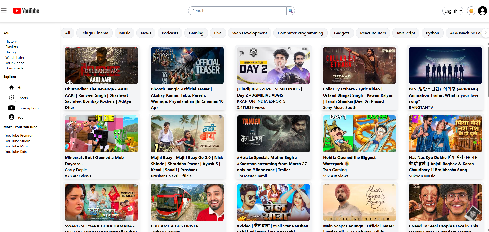
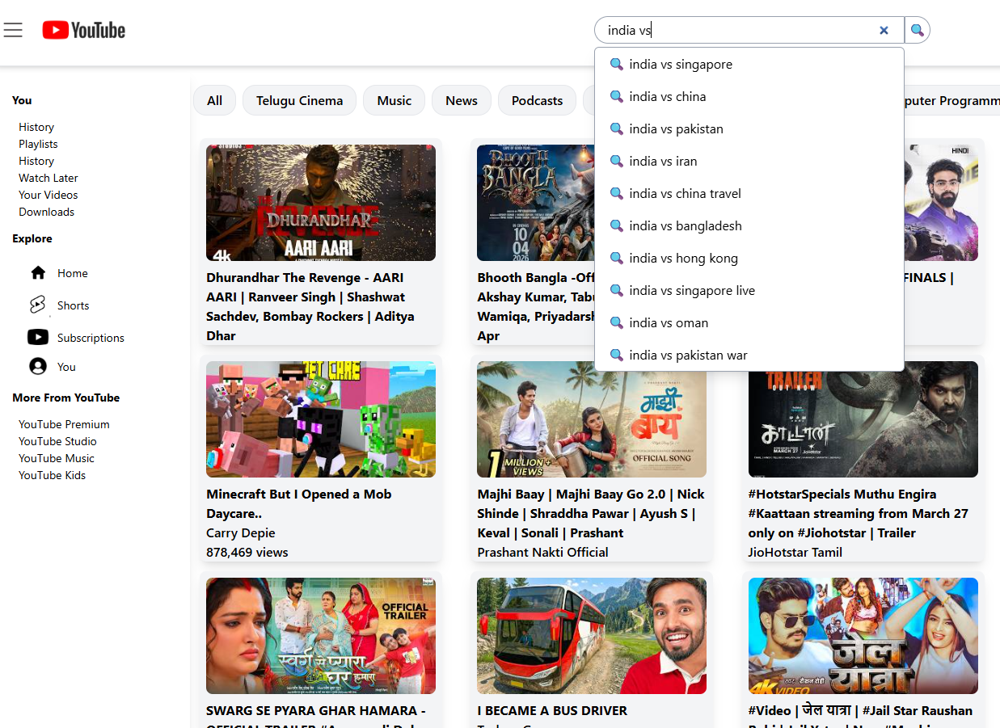
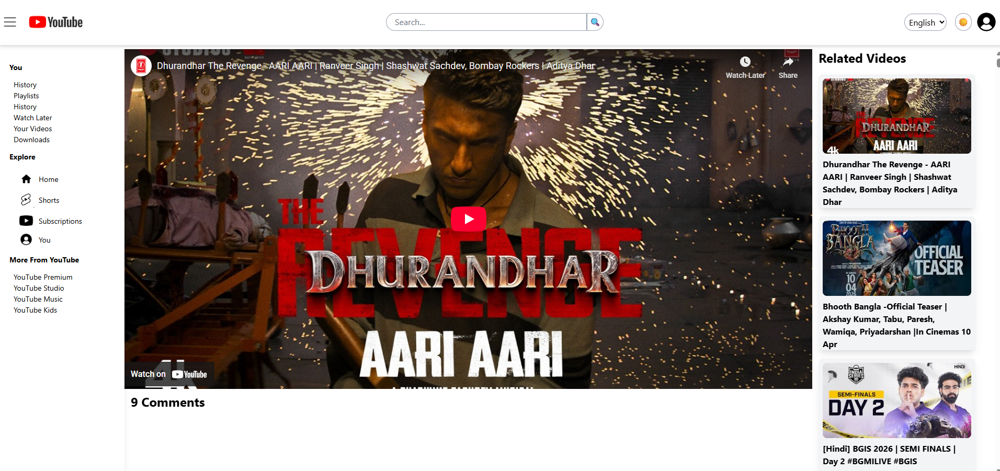

# 🎬 YouWatchTube – YouTube Clone

🔗 **Live Demo:** https://bumchick.netlify.app/

YouWatchTube is a **YouTube-inspired front-end application** that replicates core YouTube functionalities such as browsing videos, searching content, and watching videos.

The project focuses on building a **scalable React application** with optimized API calls, reusable UI components, and centralized state management using **Redux Toolkit**.

---

# 🚀 Features

### 🔍 Smart Search (Debouncing + Caching)

* Implemented **debounced search** to reduce unnecessary API calls.
* Integrated **Redux Toolkit caching** to store previously searched queries.
* Prevents duplicate API calls for the same search term.

### 🎬 Watch Page

* Dedicated **video watch page** similar to YouTube.
* Dynamic routing using **React Router**.

### 🧩 Reusable Components

The project uses modular components for scalability:

* `VideoCard`
* `VideoContainer`
* `Header`
* `Sidebar`
* `SearchSuggestions`
* `WatchPage`

### 📦 Redux Toolkit State Management

Efficient centralized state using Redux Toolkit slices:

* **searchSlice** → Search suggestion caching
* **allVideosSlice** → Video list management
* **appStore** → Global store configuration

### ⚡ Performance Optimizations

* Search **debouncing**
* **Redux caching**
* Efficient component re-rendering
* Optimized API requests

### 📱 Responsive Design

Built with **Tailwind CSS** to support multiple screen sizes.

---

# 🛠 Tech Stack

| Technology       | Usage                   |
| ---------------- | ----------------------- |
| React            | Frontend UI             |
| Redux Toolkit    | Global State Management |
| React Router     | Routing                 |
| Tailwind CSS     | Styling                 |
| YouTube Data API | Fetching video data     |
| Netlify          | Deployment              |

---

# 🏗 Application Architecture

The project follows a **component-driven architecture** with centralized state management.

```
                     YouTube API
                          │
                          │
                     API Requests
                          │
                          ▼
                  Utils / API Layer
                   (constants.js)
                          │
                          │
                   Redux Store
          ┌──────────────────────────┐
          │        appStore           │
          │                           │
          │  searchSlice              │
          │  allVideosSlice           │
          │                           │
          └────────────┬─────────────┘
                       │
                       │ Global State
                       ▼
                React Components
   ┌────────────────────────────────────┐
   │                                    │
   │ Header                             │
   │   └─ Search Suggestions            │
   │                                    │
   │ Sidebar                            │
   │                                    │
   │ VideoContainer                     │
   │   └─ VideoCard                     │
   │                                    │
   │ WatchPage                          │
   │   └─ Video Player                  │
   │                                    │
   └────────────────────────────────────┘
```

---

# 📂 Project Structure

```
src
│
├── components
│   ├── Header.js
│   ├── Sidebar.js
│   ├── VideoCard.js
│   ├── VideoContainer.js
│   ├── WatchPage.js
│   └── SearchSuggestions.js
│
├── utils
│   ├── constants.js
│   ├── searchSlice.js
│   ├── allVideosSlice.js
│   └── store.js
│
├── App.js
└── index.js
```

---

# 📸 Screenshots

### Home Page


*Add screenshot here*

### Search Suggestions


### Watch Page


---

# 🎯 Key Learnings

* Implementing **Redux Toolkit for scalable state management**
* Building **reusable React components**
* Implementing **debouncing and caching techniques**
* Optimizing **API calls and rendering performance**
* Structuring **large React projects**

---

# 🔮 Future Improvements

* Add **video comments system**
* Implement **related videos recommendations**
* Add **user authentication**
* Improve **UI animations and skeleton loaders**
* Add **dark mode**

---

# 👨‍💻 Author

**Chandra**

If you found this project helpful, consider giving it a ⭐ on GitHub.
